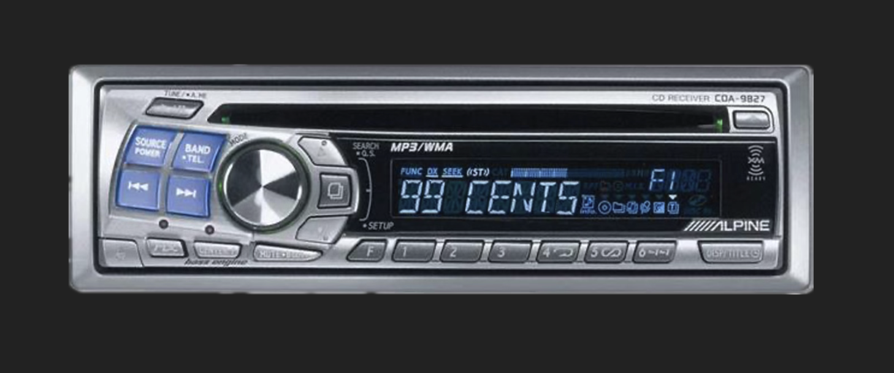

# 99 CENTS Car Stereo Player 🎵

A retro web-based music player that replicates an authentic Alpine car stereo experience with a beautiful LCD display and tactile controls.



## ✨ Features

- 🎛️ **Authentic Alpine Car Stereo Interface** - High-quality faceplate with realistic controls
- 🎵 **HTML5 Audio Playbook** - Supports MP3 audio files with seamless track transitions  
- 📱 **Invisible Hitboxes** - Click areas perfectly aligned with faceplate buttons
- 📺 **Scrolling LCD Display** - Marquee-style track title animation with retro styling
- ⌨️ **Keyboard Shortcuts** - Full keyboard control for hands-free operation
- 🔊 **Volume Control** - Smooth volume slider with real-time feedback
- 🎯 **Debug Mode** - Visual hitbox alignment tool for developers
- 📱 **Responsive Design** - Scales beautifully across different screen sizes

## 🚀 Quick Start

1. **Replace placeholder audio files** in the `/audio/` folder with your MP3s:
   - `audio/track1.mp3`
   - `audio/track2.mp3` 
   - `audio/track3.mp3`
2. **Serve the files** using any static web server:
   ```bash
   # Option 1: Python (currently running)
   python3 -m http.server 8080
   
   # Option 2: Node.js
   npx serve .
   
   # Option 3: PHP
   php -S localhost:8080
   ```
3. **Open** http://localhost:8080 in your browser
4. **Click Play** and enjoy the retro vibes! 🎶

## 🎮 Controls

### Mouse Controls
- **Play Button** - Click the large circular button (left side)
- **Next Track** - Click the forward button (right of play)  
- **Volume** - Drag the volume slider (bottom left area)

### Keyboard Shortcuts
- `SPACE` - Play/Pause toggle
- `RIGHT ARROW` - Next track
- `UP ARROW` - Volume up (+5%)
- `DOWN ARROW` - Volume down (-5%)
- `D` - Toggle debug mode (shows hitbox outlines)

## 📁 Project Structure

```
99cents-stereo/
├── index.html              # Main application (single file)
├── assets/
│   └── alpine_faceplate.png # Car stereo faceplate image
├── audio/                  # Your MP3 files go here
│   ├── track1.mp3
│   ├── track2.mp3
│   └── track3.mp3
└── README.md               # This file
```

## 🎵 Adding Your Music

1. **Prepare your MP3 files:**
   - Recommended bitrate: 128-192 kbps for web delivery
   - Name them: `track1.mp3`, `track2.mp3`, `track3.mp3`

2. **Update the playlist** in `index.html` (lines 101-113):
   ```javascript
   const tracks = [
     { 
       url: "./audio/track1.mp3", 
       title: "♪ Your Artist - Your Song Title ♪",
       artist: "Your Artist Name"
     },
     // Add more tracks...
   ];
   ```

3. **Add more tracks** by adding MP3 files and corresponding entries to the tracks array

## 🛠️ Customization

### Adjusting Hitboxes
If controls don't align perfectly:

1. Press `D` to enable debug mode
2. Inspect the dashed green outlines  
3. Edit CSS positions in the `<style>` section of index.html

### Browser Support
- ✅ Chrome 90+ (Recommended)
- ✅ Edge 90+
- ✅ Safari 14+  
- ⚠️ Firefox 88+ (Minor visual differences)

## 📄 Status

✅ **COMPLETED MVP** - All core features implemented and tested
- Single-page HTML application with embedded CSS/JS
- Alpine faceplate background with proper scaling  
- Invisible hitboxes aligned to controls
- Scrolling track title display
- Keyboard shortcuts support
- Volume control and audio management
- Debug mode for hitbox alignment
- Responsive design with mobile considerations

**Ready for deployment!** Just replace the placeholder MP3 files with your music.